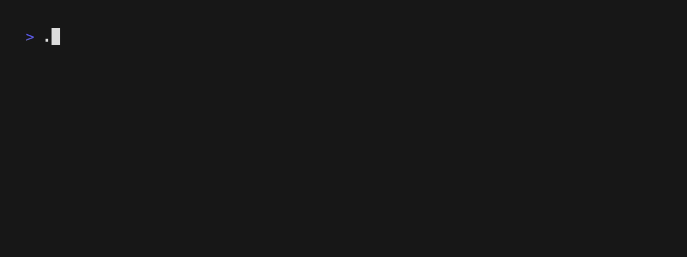

# Chatterbox CLI

Chatterbox CLI is a simple chat application that runs on the command line interface. It is a learning exercise that demonstrates the use of Go language for network programming, cryptography for secure communication, and the Bubbletea library for building user interfaces in the terminal.

This project includes a server and a client that communicate over TCP. The server can handle multiple client connections. The messages are encrypted and decrypted using a Diffie-Hellman key exchange and AES encryption for secure communication.

## Building the Project

To build this project, you need to have Go installed on your machine. Once you have Go set up, navigate to the project directory and execute the following command:

```bash
go build -o chatterbox
```

This command will build the project and create an executable file named "chatterbox".

## Running the Server

To start the server, run the following command:

```bash
./chatterbox -server
```

This command will start the server that listens for incoming connections.



## Running the Client

To start the client, run the following command:

```bash
./chatterbox
```

This will start the client. You will be prompted to enter a username and the server's address.


## Dockerfile

"Dockerfile" is included in the project directory. To build the Docker image, run the following command:

```bash
sudo docker build -t chatterbox .
```

To run the Docker container, execute the following command:

```bash
sudo docker run -it -p 5051: 5051 chatterbox
```

This will start the server inside the Docker container. You can then run the client on your local machine to connect to the server.

## Learning Experience

In this project, I dove into the intricacies of network programming using Go, explored the realm of cryptography for ensuring secure communication, and tackled the challenge of building user interfaces in the terminal with the help of the Bubbletea library. My journey was marked by the hands-on experience of managing multiple client connections on a server, implementing key exchanges for securing those connections, and mastering the creation and manipulation of terminal-based user interfaces. This undertaking was not just about coding; it was about learning, exploring, and pushing the boundaries of what I could achieve with these technologies.

## Note

This project is purely for learning and skill-building purposes. It is not intended to be used for production-level applications.
